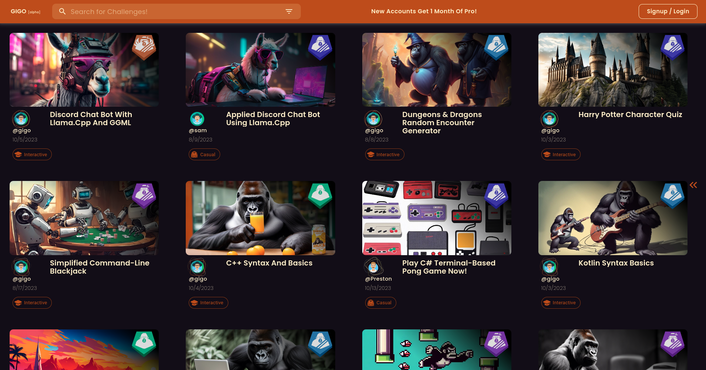

  
  <h1>Gigo: Works On Our Machine</h1>

---

**Gigo** is a one-of-a-kind online learn-to-code platform that provides an integrated learning experience, customized development environments, and a vibrant community to help you take your coding skills to the next level.

---

## Table of Contents

- [Features](#features)
- [Getting Started](#getting-started)
- [Contributing](#contributing)
- [Support](#support)
- [Security](#security)
- [License](#license)

---

## Features

### DevSpaces

- Fully containerized development environments that you can spin up in seconds.
- Pre-configured for various programming languages like Golang, Python, Java, Rust, and TypeScript.
- Built-in support for Kubernetes, Rancher, Harvester, Etcd, Nats and more.

### Open Community

- Submit your own lessons, projects, and tutorials.
- Vote and comment on community contributions.
- Engage with a network of passionate developers.

### Integrated Tutorials in Web-based VSCode

- Learn directly within a web-based VSCode interface.
- Interactive tutorials guide you step-by-step.
- No need to switch between a learning platform and your code editor.

### Remote Desktops

- Full GUI support for complex projects.
- Access your DevSpace from any device.
- Run any application or development tool.

---

## Getting Started

1. **Sign Up**
    - Visit [Gigo](https://gigo.dev) to create an account.
  
2. **Choose a Lesson or Tutorial**
    - Browse through our extensive list of lessons and pick one that interests you.

3. **Launch DevSpace**
    - Start your personalized development environment with a single click.

4. **Start Coding**
    - Follow the interactive tutorials and start coding!

---

## Contributing

We welcome contributions from the community. For guidelines and more information, see [CONTRIBUTING.md](link_to_contributing_guide).

---

## Support

For any issues or queries, reach out to us at [contact@gigo.dev](mailto:contact@gigo.dev) or join our [Discord server](https://discord.gg/syShS5as).

---

### Security

If you find a security vulnerability, do not open a Github Issue. Send an email to [sam@gigo.dev](mailto:sam@gigo.dev). The vulnerability will be patched and deployed then we will announce the disclosure and give you proper credt.

---

## License

Gigo is licensed under the [AGPLv3 License](LICENSE).

---

  <b>Join the Gigo community and elevate your coding skills!</b>

